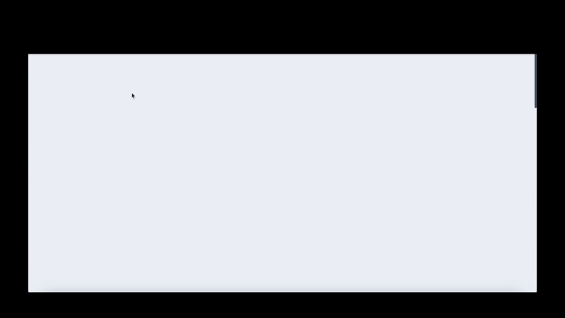

# Menelik Asfaw's Personal Site

Hey there! mini here. This is a modified version of KL's Personal site, no big UI overhauls so please check out the original template usuing this link when you have time and give KL a follow. 

This is written in Typescript using [Next.js](https://nextjs.org/), as a SSG tool. It utilizes [ChakraUI](https://chakra-ui.com/) as well as  [Framer Motion](https://www.framer.com/motion/) for animations.


This contains bits of my details. In future I am planning to get this to cater my own blog too but for now will use dev.to links. 

Site is Currently deployed at <b>Vercel</b>'s Free tier .

> Build Status 

[](https://app.netlify.com/sites/kllawingco/deploys)


## Demo




## Local Development

This is just a [Next.js](https://nextjs.org/) project bootstrapped with [`create-next-app`](https://github.com/vercel/next.js/tree/canary/packages/create-next-app).

Please use atleast Node v12, but the recommended version is Node v14 LTS. There's a `.nvmrc`, you can run `nvm use` if you have nvm installed.

## Getting Started

This project heavily favors <b>yarn</b> over npm. 

So to set things up you need to run

```bash
yarn install
```
or just
```bash
yarn
```

Then to run the development server:

```bash
yarn dev
```

and it should open at

> http://localhost:3000/


## Deployment

Nothing special, its setup at Netlify end (in other words: no `netlify.toml`), just merge a feat branch to master branch and you're good. 


## Credits

Logo and Avatar are made by my friend : <b>KojiroArt</b>.
Please check him out at his [`twitter`](https://twitter.com/kojiro_ai) account.  

And of course 
Made with Love and :coffee:

KL 
